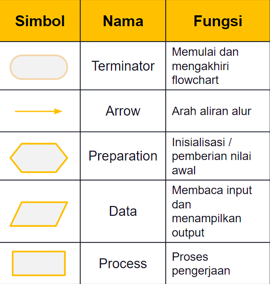

# Apa itu Algoritma ?

### **Pengertian**

**urutan atau langkah-langkah untuk menyelesaikan masalah pemrograman komputer**


**https://teknojurnal.com › pengertian-algoritma-pemrograman**


## Notasi Algoritma

1. **Untaian Kalimat Deskriptif**
2. Flowchart
3. **Pseudocode**

### **1. Untaian Kalimat Deskriptif**

**cara menuliskan instruksi - instruksi yang harus dilaksanakan dalam bentuk untaian kalimat deskriptif dengan menggunakan bahasa yang jelas**

> Contoh di Pemrograman
>
> PROGRAM Persegi Panjang Program untuk menghitung luas persegi panjang.
>
> ALGORITMA **:**&#x20;
>
> 1. Masukkan/input panjang dan lebar persegi panjang.
> 2. Hitung luas persegi panjang dengan rumus : Luas = Panjang x Lebar
> 3. Tampilkan luas persegi panjang.

### 2. Flowchart

**cara menuliskan instruksi - instruksi yang harus dilaksanakan dalam bentuk simbol-simbol diagram alir**




Dalam perancangan flowchart sebenarnya tidak ada rumus atau patokan yang bersifat mutlak (pasti). Hal ini didasari oleh flowchart (bagan alir) adalah sebuah gambaran dari hasil pemikiran dalam menganalisa suatu permasalahan dalam komputer.


### Contoh&#x20;

.JPG>)


### Apa itu variabel dan tipe data? <a href="#apa-itu-variabel-dan-tipe-data" id="apa-itu-variabel-dan-tipe-data"></a>

Variabel merupakan simbol yang digunakan untuk menyimpan sebuah nilai

tipe data adalah jenis nilai yang akan disimpan. pada umumnya variable pada bahasa pemrograman dapat menyimpan nilai berupa <mark style="color:orange;">**Number**</mark> (angka) ataupun <mark style="color:orange;">**String**</mark> (huruf)

dengan begitu kita bisa menentukan apa yang harus kita isi sesuai dengan tipe data suatu variable.


### 3. **Pseudocode**

Langkah-langkah pemecahan masalah dengan menggunakan kode yang tidak terikat pada bahasa pemrograman tertentu

```
//Contoh 1 
Contoh pseudocode mencari luas persegi panjang
    begin
        numeric panjang,lebar,luas
        display "panjang persegi panjang : "
        accept panjang
        display "lebar persegi panjang : "
        accept lebar luas=panjang*lebar
        display "luas persegi panjang : " luas
    end
    
//Contoh 2
Contoh pseudocode penjumlahan dua nomor
    begin
        numeric Num1,Num2,Sum
        display "Masukkan angka pertama : "
        accept Num1
        display "Masukkan angka kedua : "
        accept Num2
        compute Sum= Num1+ Num2
        display "Jumlah : " Sum
    end

```

****
