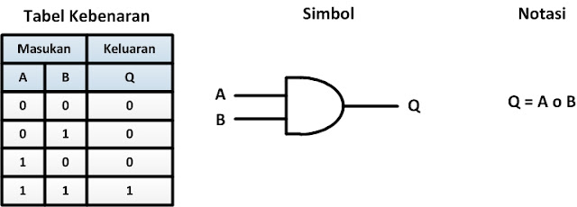

# Operator&#x20;

JavaScript mendukung banyak sekali operator Matematika untuk tipe data Number, seperti :&#x20;

1. Operator Aritmatika
2. Operator Augmented Assignments
3. Operator Unary Dan lain-lain

## **Operator Matematika**

| Operator | Keterangan              |
| -------- | ----------------------- |
|   **+**  | **Pertambahan**         |
| -        | **Pengurangan**         |
| \*       | **Perkalian**           |
| **/**    | **Pembagian**           |
| **%**    | **Sisa Bagi (modulus)** |

**Kode : Operator Aritmatika**

**Operator Augmented Assignments**

| Operator Matematika       | Operator Augmented Assigments |
| ------------------------- | ----------------------------- |
|  **result = result + 10** | **result += 10**              |
| **result = result - 10**  | **result -= 10**              |
| **result = result \* 10** | **result \*= 10**             |
| **result = result / 10**  | **result /= 10**              |
| **result = result % 10**  | **result %= 10**              |

**Kode : Operator Augmented Assigments**

## **Operasi Perbandingan**

1. Operasi perbandingan adalah operasi untuk membandingkan dua buah data
2. Operasi perbandingan adalah operasi yang menghasilkan nilai boolean (benar atau salah)
3. Jika hasil operasinya adalah benar, maka nilainya adalah true&#x20;
4. **J**ika hasil operasinya adalah salah, maka nilainya adalah false

### **Operator Perbandingan**

| Operator | Keterangan                                 |
| -------- | ------------------------------------------ |
| **>**    | **Lebih Dari**                             |
| **<**    | **Kurang Dari**                            |
| **>=**   | **Lebih Dari Sama Dengan**                 |
| **<=**   | **Kurang Dari Sama Dengan**                |
| **==**   | **Sama Dengan**                            |
| **===**  | **Sama Dengan dan Sama Tipe**              |
| **!=**   | **Tidak Sama Dengan**                      |
| **!==**  | **Tidak Sama Dengan atau Tidak Sama Tipe** |

**Kode : Operasi Perbandingan**

## **Operator Logika**

Operator logika adalah operator untuk dua buah data boolean Hasil dari operator logika adalah boolean lagi

**Operator Logika**

| Operator | Keterangan |
| -------- | ---------- |
| **&&**   | And        |
| **\|\|** | Or         |
| **!**    | Not        |

> Table kebenaran And
>
> .png>)

> Table kebenaran Or
>
> 

> Table kebenaran Not
>
> .png>)
>
>

**Kode : Operator Logika**

